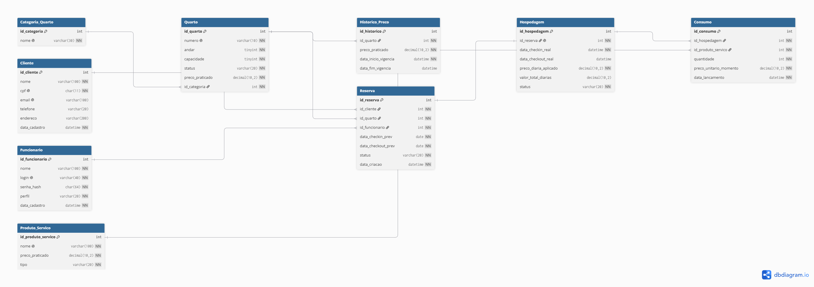

# Relatório Técnico — Sistema de Gerenciamento Hotel do Mosquito

**Disciplina:** Laboratório de Banco de Dados
**Entrega:** 01/06/2026
**Integrantes:** [preencher nomes do grupo]

---

## 1. Resumo do sistema

Sistema de gerenciamento hoteleiro para o Hotel do Mosquito, contemplando
reservas, hospedagens, consumos de produtos/serviços e relatórios gerenciais.
Implementado em MySQL com toda a comunicação encapsulada via stored procedures
e views (zero SQL cru pela rede). Interface em Python/Tkinter com autenticação
e controle de acesso por perfil (Recepcionista vs Gerente).

## 2. Modelagem

### 2.1 MER (Modelo Entidade-Relacionamento)

### 2.2 Modelo Lógico Relacional

### 2.3 Justificativa da normalização

- **1FN:** todos os atributos são atômicos. `endereco` mantido como VARCHAR único
  (conforme especificação do enunciado); uma normalização adicional em
  Logradouro/Cidade/UF/CEP seria possível mas não traz valor para o escopo.
- **2FN:** todas as PKs são simples (`id_*`); não há dependência parcial.
- **3FN:** sem dependências transitivas. `Categoria_Quarto` está isolada de
  `Quarto`; `Historico_Preco` separa o histórico do estado atual;
  `Consumo.preco_unitario_momento` é snapshot deliberado de transação
  (não viola 3FN: garante que faturamento histórico não muda se preço de
  produto for atualizado depois).

### 2.4 Decisões de modelagem importantes

- **`Quarto.preco_praticado`** é a coluna onde mora o preço atual; o trigger
  observa essa coluna.
- **`Hospedagem.preco_diaria_aplicado`** captura o preço do quarto no momento
  do check-in (snapshot). Garante que reajustes futuros de preço não alteram
  o valor cobrado em estadias em andamento.
- **`Consumo.preco_unitario_momento`** captura o preço do produto no momento do
  lançamento.

## 3. Banco de dados

### 3.1 Tabelas (visão resumida)

| Tabela | Propósito | Restrições principais |
|---|---|---|
| Categoria_Quarto | Categorias (Standard, Luxo...) | nome UNIQUE |
| Quarto | Inventário de quartos | numero UNIQUE; FK categoria; CHECK preço ≥ 0 |
| Historico_Preco | Histórico de preços por quarto | FK quarto; janela [inicio, fim) |
| Cliente | Hóspedes | CPF UNIQUE + regex; email UNIQUE |
| Funcionario | Recepcionistas e Gerentes | login UNIQUE; senha_hash SHA2-256 |
| Reserva | Reservas confirmadas/canceladas/efetivadas | CHECK datas; FKs cliente/quarto/funcionário |
| Hospedagem | Estadia em curso ou finalizada | UNIQUE id_reserva; snapshot de preço |
| Produto_Servico | Catálogo de itens consumíveis | nome UNIQUE; tipo ENUM |
| Consumo | Lançamentos durante hospedagem | snapshot de preço; CASCADE da hospedagem |

### 3.2 Integridade referencial

- Todas as FKs com `ON DELETE RESTRICT` (preserva histórico),
  exceto `Consumo → Hospedagem` com `CASCADE`.
- Exclusão lógica via mudança de `status` para Reserva (cancelamento).

### 3.3 Índices

- `Reserva(id_quarto, data_checkin_prev, data_checkout_prev)` — detecção de sobreposição.
- `Reserva(id_cliente, status)` — histórico do cliente.
- `Consumo(id_hospedagem)` — soma de consumos no checkout.
- `Historico_Preco(id_quarto, data_fim_vigencia)` — preço em vigor em data X.

## 4. Encapsulamento total (CRUD via Stored Procedures)

| Entidade | Procedures |
|---|---|
| Cliente | `sp_Cliente_Create`, `_Read`, `_Update`, `_Delete` |
| Quarto | `sp_Quarto_Create`, `_Read`, `_Update`, `_Delete`, `sp_AtualizarPrecoQuarto` |
| Funcionário (restrito a Gerente) | `sp_Funcionario_Create`, `_Read`, `_Update`, `_Delete` |
| Reserva | `sp_RegistrarReserva`, `sp_Reserva_Read`, `_Update`, `_Delete` |
| Categoria/Produto | `sp_Categoria_*`, `sp_ProdutoServico_*` |

A aplicação Python nunca executa INSERT/UPDATE/DELETE crus. Toda chamada é
`cursor.callproc(...)` ou `SELECT * FROM vw_*`. A camada `app/db/` expõe uma
função por procedure.

## 5. Views (7 no total)

- **Obrigatórias:** `vw_quartos_disponiveis`, `vw_ocupacao_atual`,
  `vw_historico_reservas_cliente`.
- **Relatórios:** `vw_taxa_ocupacao_mensal`, `vw_top_clientes_assiduos`,
  `vw_top_quartos_reservados`, `vw_faturamento_mensal`.

## 6. Stored Procedures Transacionais

### 6.1 `sp_RegistrarReserva`
Detecta sobreposição de período no mesmo quarto antes de inserir. Tudo
dentro de `START TRANSACTION` com handler de rollback em caso de erro.

### 6.2 `sp_RealizarCheckIn`
Valida reserva e quarto, atualiza status de ambos, insere hospedagem com
snapshot do preço atual. Transacional.

### 6.3 `sp_RealizarCheckOut`
Calcula `nº_diárias × preco_diaria_aplicado` + soma de consumos, atualiza
hospedagem e quarto. Retorna o valor total (qualquer perfil pode ver).

### 6.4 `sp_LancarConsumo`
Valida que a hospedagem está Ativa, captura o preço atual do produto, insere
em Consumo. Transacional.

## 7. Transações puras (fora de SP)

### 7.1 Seed transacional
O script `05_seed_data.sql` está totalmente envolto em `START TRANSACTION` /
`COMMIT` com `SAVEPOINT` entre cada seção (categorias, quartos, clientes,
funcionários, produtos, reservas, hospedagens, consumos). Garante atomicidade
do carregamento inicial.

### 7.2 Script demonstrativo
`99_demo_transacoes.sql` mostra 3 cenários: COMMIT bem-sucedido, ROLLBACK
manual (com observação de Historico_Preco antes/depois), e SAVEPOINT com
rollback parcial.

## 8. Triggers

### 8.1 `trg_atualiza_preco_quarto` (obrigatória)
`AFTER UPDATE` em `Quarto` quando `OLD.preco_praticado <> NEW.preco_praticado`.
Fecha a vigência aberta em `Historico_Preco` e abre uma nova. Mantém a
invariante mesmo se alguém atualizar o preço diretamente via Workbench.

### 8.2 `trg_preco_inicial_quarto`
`AFTER INSERT` em `Quarto`. Cria a primeira entrada em `Historico_Preco` com
`data_fim_vigencia=NULL`. Garante histórico desde o nascimento do quarto.

## 9. Segurança

- **Hash de senha:** `SHA2(senha, 256)` (CHAR(64)). Aplicado dentro do MySQL.
  Senha em texto puro nunca é armazenada nem retornada por procedures.
- **Controle de perfil em camadas:**
  1. **Banco:** procedures de relatório e CRUD de Funcionário usam
     `sp_AssertGerente` que lança `SIGNAL` se o executor não for Gerente.
     Mesmo um acesso direto via Workbench com credenciais de recepcionista
     é bloqueado.
  2. **UI:** as abas Funcionários e Relatórios não são construídas se
     `perfil != 'Gerente'`. Defesa em profundidade.

## 10. Interface

[Inserir prints de tela]

- Login (credencial correta)
- Login (credencial errada → mensagem de erro)
- Aba Clientes
- Aba Reservas (registrar reserva)
- Aba Hospedagem (check-in, lançamento de consumo)
- Aba Hospedagem (modal de check-out com valor total)
- Aba Relatórios (Taxa de Ocupação)
- Login como Recepcionista (sem abas restritas)

## 11. Casos de teste

| # | Cenário | Entrada | Esperado | Observado |
|---|---|---|---|---|
| 1 | Login com senha errada | gerente1 / xxx | "Credenciais invalidas" | [preencher] |
| 2 | Login OK retorna perfil | gerente1 / senha123 | Perfil='Gerente' | [preencher] |
| 3 | Sobreposição de reserva | Quarto 6 com período coincidente | "Periodo sobreposto" | [preencher] |
| 4 | Check-in em reserva Cancelada | sp_RealizarCheckIn em reserva 10 | "Reserva nao esta Confirmada" | [preencher] |
| 5 | Check-out em hospedagem Finalizada | sp_RealizarCheckOut em hospedagem 1 | "Hospedagem nao esta Ativa" | [preencher] |
| 6 | Recepcionista chama relatório direto no Workbench | `CALL sp_Relatorio_FaturamentoMensal(3, 2026, 5);` | "Acesso negado: operacao restrita a Gerentes" | [preencher] |
| 7 | UPDATE direto em Quarto.preco_praticado | `UPDATE Quarto SET preco_praticado=999 WHERE id_quarto=1;` | Nova linha em Historico_Preco; vigência anterior fechada | [preencher] |
| 8 | ROLLBACK após alteração de preço | Cenário 2 do demo | Historico_Preco volta ao estado original | [preencher] |
| 9 | DELETE em Cliente com reservas | `DELETE FROM Cliente WHERE id_cliente=1;` | Erro de FK (RESTRICT) | [preencher] |
| 10 | INSERT em Consumo com quantidade=0 | sp_LancarConsumo(6, 1, 0) | "Quantidade deve ser positiva" | [preencher] |
| 11 | Reajuste de preço durante hospedagem ativa | sp_AtualizarPrecoQuarto durante hospedagem 6 → check-out | valor cobrado usa preco_diaria_aplicado (snapshot) | [preencher] |

## 12. Principais Dificuldades Encontradas pelo Grupo

> **Esta seção é OBRIGATÓRIA pelo enunciado e precisa ter ao menos 1 página.**
> Preencher com a história real do desenvolvimento. Sugestões de tópicos:

- **Configuração inicial do MySQL + Workbench no Windows:** [descrever]
- **Encapsulamento total sem SQL cru:** desafio de mapear cada operação da UI
  a uma procedure correspondente; uso de `cursor.callproc` em Python e como
  extrair múltiplos resultsets.
- **Definição de quando usar transação dentro de procedure vs. transação pura:**
  análise dos casos de uso e decisão por dupla abordagem.
- **Sobreposição de reservas:** lógica de detecção com `NOT (a.fim ≤ b.inicio OR a.inicio ≥ b.fim)`.
- **Trigger e snapshot de preço:** garantir que reajustes futuros não afetem
  estadias em curso — solução com `preco_diaria_aplicado` em Hospedagem.
- **SHA2 vs BCRYPT:** decisão por SHA2 no banco para simplicidade do trabalho
  acadêmico; mencionar limitações conhecidas (sem salt) e por que BCRYPT seria
  preferível em produção.
- **Controle de acesso em duas camadas:** raciocínio sobre defesa em profundidade.
- **Layout de Tkinter:** Notebook + abas dinâmicas conforme perfil.
